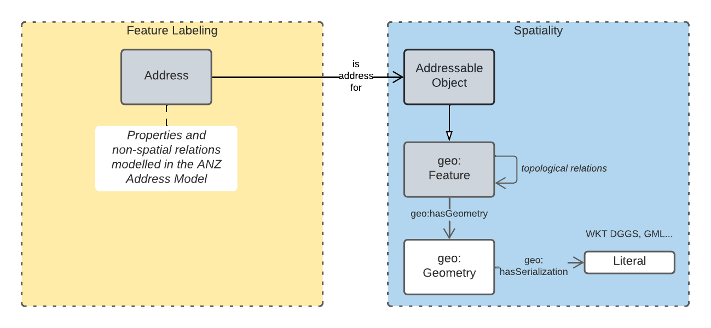

== Introduction

In 2021, the https://www.icsm.gov.au/[Intergovernmental Committee on Surveying and Mapping] established an https://www.icsm.gov.au/publications/addressing-2035[Addressing 2035] strategy that aimed to "provide leadership, coordination and standards for assembling, delivering and maintaining address datasets". The Strategy listed "Strategic Pillars", such as "Jurisdictional
flexibility" - things for Strategy implementers to aim for - "Guiding Principles", "Overarching Pain Points" and other system/model/situation requirements. It did not present an address model.

This model is created with alignment to the Addressing 2035 Strategy as a high priority, so it's use aims to address Pain Points identified in the Strategy.

The model is mostly based on the structures of International Addressing standard, ISO19160-1, but this model is expressed in Semantic Web form. Unlike ISO19160-1, this model also re-uses elements from other, well-known, Semantic Web models, as is the Semantic Web norm.

This model does not model _all_ of address data managers' concerns: it leaves things like the detailed modelling of spatial information to other models or extensions to this model. Also, by reusing elements from well-known Semantic Web models, this model has many "pick-up" points that can be used to join other information on to. For example, the `Resource` indicated as an `Address Component` value, may be a locally-defined simple value type - a number or string - but it may also be a complex object defined elsewhere, such as a `Locality`.

=== Address / Spatial object principle

This model details the elements of an _address_ but not details of the spatial objects that addresses are assigned to. The general conceptual split of address/spatial object follows the Address/AddressableObject split in ISO19160-1 <<ISO19160-1>> with some further integration of the AddressableObject concpet with general-purpose spatial models, in particular GeoSPARQL <<GEO>>.

The following figure overviews this model's address / spatial object split.

[[fig-address-spatial]]
.Address / spatial object relation overview

In the figure above, the spatial object that is the target of an address, an _addressable object_, is a subclass of (special type of) the GeoSPARQL model's `Feature` class, which is really any geospatial feature. Spatial relations between addresses and other objects and spatial projects of objects (their geometries) are then modelled as spatial concerns within GeoSPARQL's general spatial modelling.

The only exception to this are addresses' geocodes which are modeled as direct properties of (related geometries of) addresses. This is because while an address might be for a spatial object with a certain geometry, the geocode for the address might not be directly inherited from that spatial object but might be manually or otherwise defined.

For example, an emergency services access address for a hospital might need a more precise location than the footprint of the hospital property with might be large. In this case, an address with the _emergency access_ role may be defined for the hospital with a precise point geocode which will likely be on or close to the hospital building's boundary.

=== Model resources

This document is this model's "Specification" which is its authoratitive, human-readable, definition document. This model also contains other resources with other roles:

[width="75%", cols="2,1,4"]
|===
| Resource | Role | Notes

| https://nicholascar.com/anz-nat-addr-model-candidate/model.ttl[Ontology] | _Schema_ | The technical, machine-readable, version of this model
| <<Supporting Vocabularies>> | _Vocabulary_ | The codelist vocabularies developed for this model and links to others  defined elsewhere but used by this model
| <<Annex A: Validators>> & https://nicholascar.com/anz-nat-addr-model-candidate/validator.shacl.ttl[Validator] | _Validation_ | The machine-readable validator file used to validate data claiming conformance to this model
| <<Annex B: Extended Examples>>
&
https://github.com/nicholascar/anz-nat-addr-model-candidate/tree/main/extended-examples[Extended example data files] | _Example_ | Examples of data conforming, and some not conforming, to this model
| <<Annex C: Demo Implementations>> | _Example_ | Demonstration implementations of this model in various database forms
|===
