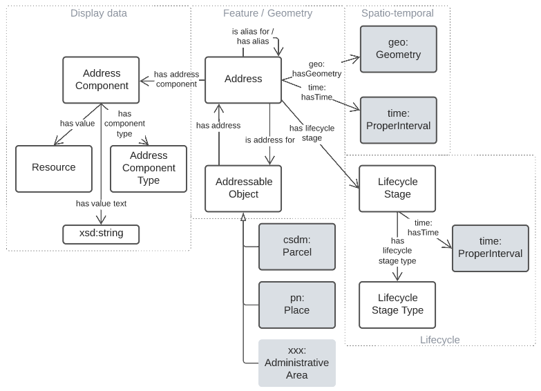
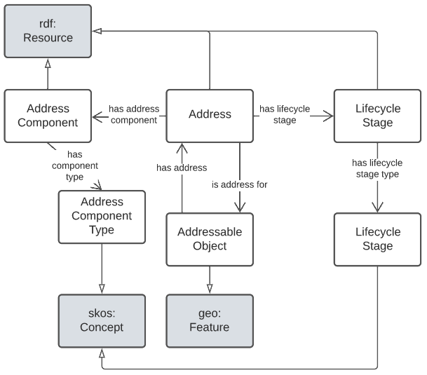
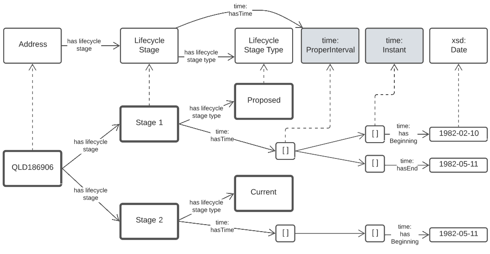

= ANZ National Address Model - Candidate
:toc: left
:table-stripes: even
:sectids:
:sectanchors:
:sectnums:

== Metadata

[width=75%, frame=none, grid=none, cols="1,5"]
|===
|**IRI** | `http://w3id.org/profile/anz-address`
|**Preferred Label** | ANZ National Address Model - Candidate
|**Definition** | This model is a Semantic Web data model used for address information.
|**Created** | 2021-12-16
|**Modified** | 2022-04-27
|**Issued** | 0000-00-00
|**Creator** | https://orcid.org/0000-0002-8742-7730[Nicholas J. Car]
|**Publisher** | -
|**Provenance** | This model is is based primarilty on the ISO19160-1 Addressing Part 1: Conceptual model with additional elements from a small set of well-regarded Semantic Web models such as GeoSPARQL and SKOS
|**Status** | Early draft
|**Version** | add:0.0.1
|**Code Repository** | https://nicholascar.com/anz-nat-addr-model-candidate
|**License** | https://creativecommons.org/licenses/by/4.0/[Creative Commons Attribution 4.0 International (CC BY 4.0)]
|**Copyright** | _unassigned as of 2022_
|===

== Preamble

=== Abstract

[NOTE]
This Model is a candidate model for Australian & New Zealand address information. It is currently an unofficial model that is not yet published as a standard.

This model is a Semantic Web data model used for address information. It is based primarilty on the ISO19160-1 _Addressing Part 1: Conceptual model_ <<ISO19160-1>> with additional elements from a small set of well-regarded Semantic Web models such as GeoSPARQL <<GEO>> and SKOS <<SKOS>>.

=== Namespaces

This model is built on a small set of well-regarded Semantic Web models which use a variatey of namespaces. Prefixes for this namespaces, used througout this document, are listed below.

[width=100%, frame=none, grid=none, cols="1,4,5"]
|===
|Prefix | Namespace | Description

| `*add:*` | `*http://w3id.org/profile/anz-address/*` | *Placeholder namespace for this model*
| `role:` | `http://w3id.org/profile/anz-address/address-roles/` | Placeholder for the Address Roles Vocabulary
| `asgsed3:` | `http://linked.data.gov.au/dataset/asgsed3/` | Australian Statistical Geographies Standard Dataset, Release 3
|`dcterms:` | `http://purl.org/dc/terms/` | Dublin Core Terms vocabulary namespace
|`ex:` | `http://example.com/thing` | Generic examples namespace
|`geo:` | `http://www.opengis.net/ont/geosparql#` | OGC GeoSPARQL
| `isov1:` | `http://def.isotc211.org/iso19160/-1/2015/Address/code/AddressComponentType/` | <<ISO19160-1>>'s `AddressComponentType` vocabulary namespace
| `isov2:` | `http://def.isotc211.org/iso19160/-1/2015/Address/code/AddressLifecycleStage/` | <<ISO19160-1>>'s `AddressLifecycleStage` vocabulary namespace
| `isov3:` | `http://def.isotc211.org/iso19160/-1/2015/Address/code/AddressStatus/` | <<ISO19160-1>>'s `AddressStatus` vocabulary namespace
|`owl:` | `http://www.w3.org/2002/07/owl#` | Web Ontology Language ontology namespace
|`rdfs:` | `http://www.w3.org/2000/01/rdf-schema#` | RDF Schema ontology namespace
|`sosa:` | `http://www.w3.org/ns/sosa/` | Sensor, Observation, Sample, and Actuator ontology namespace
|`skos:` | `http://www.w3.org/2004/02/skos/core#` | Simple Knowledge Organization System (SKOS) ontology namespace
|`time:` | `http://www.w3.org/2006/time#` | Time Ontology in OWL namespace
|`void:` | `http://rdfs.org/ns/void#` | Vocabulary of Interlinked Data (VoID) ontology namespace
|`xsd:` | `http://www.w3.org/2001/XMLSchema#` | XML Schema Definitions ontology namespace
|===

=== Conformance

This model conforms to the https://w3id.org/profile/ontpub[OntPub Profile] which is a specification for ontology publication that mandates certain structural and metadata properties for the model as a whole and model elements. Metadata elements for the model as a whole - the ontology - are given in the <<Metadata>> section above.

==== Figures

Figures used in this document use the following key:

[[fig-figure-key]]
.Key of elements used in this Model's figures
image::img/key.png[]

==== Exampl Data
Exampl Data used in this document, for instance in model element "Example" values, are https://www.w3.org/RDF/[RDF] data in the https://www.w3.org/TR/turtle/[Turtle] tyntax.

== Introduction

In 2021, the https://www.icsm.gov.au/[Intergovernmental Committee on Surveying and Mapping] established an https://www.icsm.gov.au/publications/addressing-2035[Addressing 2035] strategy that aimed to "provide leadership, coordination and standards for assembling, delivering and maintaining address datasets". The Strategy listed "Strategic Pillars", such as "Jurisdictional
flexibility" - things for Strategy implementers to aim for - "Guiding Principles", "Overarching Pain Points" and other system/model/situation requirements. It did not present an address model.

This model is created with alignment to the Addressing 2035 Strategy as a high priority, so it's use aims to address Pain Points identified in the Strategy.

The model is mostly an based on the structures of International Addressing standard, ISO19160-1, but this model is expressed in Semantic Web form. Unlike ISO19160-1, this model also re-uses elements from other, well-known, Semantic Web models, as is the Semantic Web norm.

This model does not model _all_ of address data managers' concerns: it leaves things like the detailed modellign os spatial information to other models or extensions to this model. Also, by reusing elements from well-known Semantic Web models, this model has many "pick-up" points that can be used to join other information on to. For example, the `Resource` indicated as an `Address Component` value, may be a locally-defined simple value type - a number or string - but it may also be a complex object defined elsewhere, such as a `Locality`.

=== Model resources

This document is this model's "Specification" which is its authoratitive, human-readable, definition document. This model also contains other resources with other roles:

[width="50%", cols="1,1,3"]
|===
| Resource | Role | Notes

| https://nicholascar.com/anz-nat-addr-model-candidate/model.ttl[Ontology] | _Schema_ | The technical, machine-readable, data model of this model
| https://nicholascar.com/anz-nat-addr-model-candidate/validator.shacl.ttl[Validator] | _Validation_ | The machine-readable constraints file used to validate data claiming conformance to this model
| https://github.com/nicholascar/anz-nat-addr-model-candidate/tree/main/example[Example files] | _Example_ | Examples of data conforming, and some not conforming, to this model
|===

== Model

This model is composed of Web Ontology Language (OWL) <<OWL>> Classes and Properties. While some of the properties are restricted in their use to various classes, the Classes and Properties are actually defined individually and both are "first class model citizens", with golbal identity, that can be used in isolation as well as together. This is in contrast to Unified Modelling Language (UML) _Class Diagrams_ which treat Properties as sub-parts of particular classes.

This model defines some Classes and Properties and also requires certain existing Cs & Ps for reuse. All Cs & Ps in this model, both defined and reused, are listed here with an indication of where the element is difined given in the _Is Defined By_ field.

[[fig-overview]]
.An informal Model Overview diagram showing the major elements of this model

[[fig-upper-classes]]
.Mapping of the main model classes to common Semantic Web classes

[[Classes]]
=== Classes

* <<Address>>
* <<AddressableObject, Addressable Object>>
* <<AddressComponent, Address Component>>
* <<AddressComponentType, Address Component Type>>
* <<AddressLifecycleStage, Address Lifecycle Stage>>
* <<AddressLifecycleStageType, Address Lifecycle StageType>>
* <<AddressRole, Address Role>>

[[Address]]
==== Address

[cols="2,6"]
|===
| Property | Value

| IRI | `add:Address`
| Preferred Label | Address
| Definition | The Address class represents structured information that allows unambiguous determination of an object for the purposes of identification and location
| Is Defined By | http://w3id.org/profile/anz-address/[ANZ National Address Model]
| Sub-class Of | https://opengeospatial.github.io/ogc-geosparql/geosparql11/spec.html#_class_geofeature[`geo:Feature`]
| Provenance | Derived from <<ISO19160-1>>'s `Address` class
| Usage note | -
| Expected Properties | <<isAddressFor>>, <<hasAddressComponent>>, <<hasAddressRole>>, <<hasLifecycleStage>>
| Example 
a| [source,turtle]
----
BASE <http://linked.data.gov.au/dataset/asgsed3/>

ex:addr-1
  a addr:Address ;
  addr:isAddressFor <some-external-object> ;
  addr:hasAddressComponent 
    [   
      addr:hasValue 20 ;
      addr:hasComponentType addrct:streetNumber ;
    ] ,
    [
      addr:hasValue "Oxford" ;
      addr:hasComponentType addrct:thoroughfareName ;
    ] ,
    [
      addr:hasValue strt:Place ;
      addr:hasValueText "Place" ;
      addr:hasComponentType addct:StreetType ;
    ] ,
    [
      addr:hasValue <LGA2021/1234> ;
      addr:hasValueText "Shorncliffe" ;
      addr:hasComponentType addrct:localityName ;
    ] ,
    [
      addr:hasValue <STE2021/6> ;
      addr:hasValueText "Queensland" ;
      addr:hasComponentType addct:StateOrTerritory ;
    ] ,
    [
      addr:hasValue <AUS2021/AUS> ;
      addr:hasValueText "Australia" ;
      addr:hasComponentType addct:Nation ;
    ] ;
.
----
|===

[[AddressableObject]]
==== Addressable Object

[cols="2,6"]
|===
| Property | Value

| IRI | `add:AddressableObject`
| Preferred Label | Addressable Object
| Definition | An object that is unambiguously determined by an address.

Examples of types of AddressableObjects are a building, a dwelling or a land parcel
| Is Defined By | http://w3id.org/profile/anz-address/[ANZ National Address Model]
| Sub-class Of | https://opengeospatial.github.io/ogc-geosparql/geosparql11/spec.html#_class_geofeature[`geo:Feature`]
| Provenance | Derived from <<ISO19160-1>>'s `AddressableObject` class and its associated codelist of subtypes
| Usage note | Judgement as to what makes for a permissable AddressableObject rests with the implementer. This model's technical requirements are only that the object is a legal `geo:Feature` object, thus implementers may make Addressable Objects of almost anything.
| Expected Properties | <<hasAddress>>, http://www.opengis.net/ont/geosparql#[`geo:hasGeometry`]
| Example 
a| [source,turtle]
----
# ex:parcel-x is inferred to be an Addressable object
# due to the property addr:hasAddress indicated for it
ex:parcel-x addr:hasAddress ex:addr-1 .

# this object is declared to be an Addressable Object
<http://example.com/building/y>
  a addr:AddressableObject ;
  rdfs:label "Building Y" ;
.

# ex:admin-area-z is inferred to be an Addressable Object
# due to the property addr:isAddressFor indicating it
ex:addre-2 addr:isAddressFor ex:admin-area-z .
----
|===

[[AddressComponent]]
==== Address Component

[cols="2,6"]
|===
| Property | Value

| IRI | `add:AddressComponent`
| Preferred Label | Address Component
| Definition | A component that is a constituent part of an address
| Is Defined By | http://w3id.org/profile/anz-address/[ANZ National Address Model]
| Sub-class Of | http://www.w3.org/2000/01/rdf-schema#Resource[`rdfs:Resource`]
| Provenance | Derived from <<ISO19160-1>>'s `AddressComponent` class
| Usage note | Address Components can be literals - numbers, words etc. - or complex ojects - Localities, districtes etc. If the Address Component is a complex object, a textual representation of it must be provided when a textual rendering of all of an Addresses' component are required, for example for letter printing. 

Complex objects are preferred for use over literals when the object referred to has independent identity.

Ordering of Address Components, for example for letter printing, is not fixed within this model but should be implemented with a positioning preference system utilising the Address Component's `addr:hasComponentType` values which should come from a controlled vocabulary of Address Component Type values.
| Expected Properties | <<hasValue>>, <<hasValueText>>, <<hasComponentType>>
| Example 
a| [source,turtle]
----
ex:addr-1
  a addr:Address ;
  addr:hasAddressComponent 
    [
      # a simple numerical literal - street number
      addr:hasValue 20 ;
      addr:hasComponentType addrct:streetNumber ;
    ] ,
    [
      # a simple literal - street name
      addr:hasValue "Oxford" ;
      addr:hasComponentType addrct:thoroughfareName ;
    ] ,
    [
      # complex object - a Locality
      addr:hasValue <http://example.com/lga/1234> ;
      # textual value of complex object
      addr:hasValueText "Shorncliffe" ;
      addr:hasComponentType addrct:localityName ;
    ] ,
    ... 
----
|===

[[AddressComponentType]]
==== Address Component Type

[cols="2,6"]
|===
| Property | Value

| IRI | `add:AddressComponentType`
| Preferred Label | Address Component Type
| Definition | Code that specifies the kind of address component
| Is Defined By | http://w3id.org/profile/anz-address/[ANZ National Address Model]
| Sub-class Of | http://www.w3.org/2004/02/skos/core#Concept[`skos:Concept`]
| Provenance | Derived from <<ISO19160-1>>'s `AddressComponent` class
| Usage note | An Address Component's type should be indicated with values from a controlled vocabulary - a code list. 

A SKOS vocabulary of Address Component Types is suplied with this ontology.
| Expected Properties | Standard properties for a SKOS Concept
| Example 
a| [source,turtle]
----
ex:addr-1
  a addr:Address ;
  addr:hasAddressComponent 
    [
      # "StreetNumber" type
      addr:hasValue 20 ;
      addr:hasComponentType addrct:streetNumber ;
    ] ,
    [
      # "StreetName" type
      addr:hasValue "Oxford" ;
      addr:hasComponentType addrct:thoroughfareName ;
    ] ,
    [
      # "Locality" type
      addr:hasValue <http://example.com/lga/1234> ;
      # textual value of complex object
      addr:hasValueText "Shorncliffe" ;
      addr:hasComponentType addrct:localityName ;
    ] ,
    ... 
----
|===

[[AddressLifecycleStage]]
==== Address Lifecycle Stage

[[fig-lifecycle-stages]]
.An example Address, `QLD186906`, with Lifecycle Stages

[cols="2,6"]
|===
| Property | Value

| IRI | `add:AddressLifecycleStage`
| Preferred Label | Address Lifecycle Stage
| Definition | An AddressLifecycleStage represents the different lifecycle stages of an Address
| Is Defined By | http://w3id.org/profile/anz-address/[ANZ National Address Model]
| Sub-class Of | http://www.w3.org/2004/02/skos/core#Concept[`skos:Concept`]
| Provenance | Derived from <<ISO19160-1>>'s `AddressComponent` class
| Usage note | An Address Lifecycle Stage's type should be indicated with values from a controlled vocabulary - a code list. 

A SKOS vocabulary of Address Lifecycle Stages is suplied with this ontology.

In this model, these Lifecycle Stages are defined for use with Addresses only, not also Address Components, as per ISO19160-1.
| Expected Properties | Standard properties for a SKOS Concept
| Example 
a| [source,turtle]
----
# An Address with two Lifecycle Stages indicated:
# one current and one past
ex:addr-1
  a addr:Address ;
  addr:hasLifeCycleStage [
    # this Stage has ceased
    time:hasTime [
      time:hasBeginning [ time:inXSDDate "1982-02-10"^^xsd:date ] ;
      time:hasEnd [ time:inXSDDate "1982-05-11"^^xsd:date ] ;      
    ] ;
    addr:hasLifeCycleStageType addrls:proposed ;
  ] ,
  [
    # this Stage is still in effect - no hasEnd given
    time:hasTime [
      time:hasBeginning [ time:inXSDDate "1982-05-11"^^xsd:date ] ;        
    ] ;
    addr:hasLifeCycleStageType addrls:current ;
  ] ,  
.

# The Address Lifecycle Stage 'proposed'
# from the Address Lifecycle Stage Types vocabulary
# indicating only some properties
addrls:proposed
    a skos:Concept ;
    ...
    skos:prefLabel "Proposed" ;
.
----
|===

[[AddressLifecycleStageType]]
==== Address Lifecycle Stage Type

[cols="2,6"]
|===
| Property | Value

| IRI | `add:AddressLifecycleStageType`
| Preferred Label | Address Lifecycle Stage Type
| Definition | Code that specifies the kind of Address Lifecycle Stage
| Is Defined By | http://w3id.org/profile/anz-address/[ANZ National Address Model]
| Sub-class Of | http://www.w3.org/2004/02/skos/core#Concept[`skos:Concept`]
| Provenance | Derived from <<ISO19160-1>>'s `AddressLifecycle` class
| Usage note | An Address Address Lifecycle Stage's type should be indicated with values from a controlled vocabulary - a code list. 

A SKOS vocabulary of Address Lifecycle Stage Types is suplied with this ontology.
| Expected Properties | Standard properties for a SKOS Concept
| Example 
a| [source,turtle]
----
# An Address with a Lifecycle Stages indicated
# which then indicates its type
ex:addr-1
  a addr:Address ;
  addr:hasLifeCycleStage [
    ...
    addr:hasLifeCycleStageType addrls:proposed ;
  ] ;
  ...
.
----
|===

[[AddressRole]]
==== Address Role

[cols="2,6"]
|===
| Property | Value

| IRI | `add:AddressRole`
| Preferred Label | Address Role
| Definition | AddressRole represents a task for which this Address may be used
| Is Defined By | http://w3id.org/profile/anz-address/[ANZ National Address Model]
| Sub-class Of | http://www.w3.org/2004/02/skos/core#Concept[`skos:Concept`]
| Provenance | Derived from <<ISO19160-1>>'s `AddressPosition` & `AddressPositionType` classes
| Usage note | ISO19160-1 does not contain an `AddressRole` class but instead an `AddressPosition` class with positioning and role properties. This Standard make role a direct property of `Address` instead and provides for a positional qualifier (qualified against the position of the `AddressableObject`) instead to allow whole addresses to carry role tasking.
| Expected Properties | Standard properties for a SKOS Concept
| Example 
a| [source,turtle]
----
# An Address with two roles
ex:addr-1
  a addr:Address ;
  addr:hasAddressRole 
    ex:emergencyAccess ,
    buildingAccessPoint ;
    ... 
----
|===

[[Properties]]
=== Properties

* <<isAddressFor, is address for>>
* <<hasAddress, has address>>
* <<hasAddressComponent, has address component>>
* <<hasAddressComponentType, has address component type>>
* <<hasAddressRole, has address role>>
* <<hasLifecycleStage, has lifecycle stage >>
* <<hasLifecycleStageType, has lifecycle stage type>>

[[isAddressFor]]
==== is address for

[cols="2,6"]
|===
| Property | Value

| IRI | `add:isAddressFor`
| Preferred Label | is address for
| Definition | Indicates an Addressable Object that an Address is allocated to
| Is Defined By | http://w3id.org/profile/anz-address/[ANZ National Address Model]
| Sub-property Of | http://www.w3.org/2000/01/rdf-schema#label[`rdfs:label`]
| Inverse Of | <<hasAddress>>
| Provenance | Derived from <<ISO19160-1>>'s object relations
| Domain | <<Address, Address>>
| Range | <<AddressableObject, Addressable Object>>
| Example 
a| [source,turtle]
----
# the Address ex:addr-1 is allocated to
# some-addressable-object
ex:addr-1
  a addr:Address ;
  addr:isAddressFor <some-addressable-object> ;
.
----
|===

[[hasAddress]]
==== has address

[cols="2,6"]
|===
| Property | Value

| IRI | `add:hasAddress`
| Preferred Label | has address
| Definition | Indicates an Address has been allocated for an Addressable Object
| Is Defined By | http://w3id.org/profile/anz-address/[ANZ National Address Model]
| Inverse Of | <<isAddressFor>>
| Provenance | Derived from <<ISO19160-1>>'s object relations
| Domain | <<AddressableObject, Addressable Object>>
| Range | <<Address, Address>>
| Example 
a| [source,turtle]
----
# the addr:AddressableObject, some-addressable-object,
# indicates an address with addr:hasAddress 
<some-addressable-object>
  a addr:AddressableObject ;
  addr:hasAddress ex:addr-1 ;
.

ex:addr-1
  a addr:Address ;
.
----
|===

[[hasAddressComponent]]
==== has address component

[cols="2,6"]
|===
| Property | Value

| IRI | `add:hasAddressComponent`
| Preferred Label | has address component
| Definition | Indicates an Address Component for an Address
| Is Defined By | http://w3id.org/profile/anz-address/[ANZ National Address Model]
| Provenance | Derived from <<ISO19160-1>>'s object relations
| Domain | <<Address, Address>>
| Range | <<AddressComponent, Address Component>>
| Example 
a| [source,turtle]
----
# an Address has an Address Component, a street number, indicated
ex:addr-1
  a addr:Address ;
  addr:hasAddressComponent [
      addr:hasValue 20 ;
      addr:hasComponentType addrct:streetNumber ;
    ] ,
...
----
|===

[[hasAddressComponentType]]
==== has address component type

[cols="2,6"]
|===
| Property | Value

| IRI | `add:hasAddressComponentType`
| Preferred Label | has address component type
| Definition | Indicates an Addresses Component's type
| Is Defined By | http://w3id.org/profile/anz-address/[ANZ National Address Model]
| Provenance | Derived from <<ISO19160-1>>'s object relations
| Domain | <<AddressComponent, Address Component>>
| Range | <<AddressComponentType, Address Component Type>>
| Example 
a| [source,turtle]
----
# an Address has an Address Component with its type,
# street number, indicated
ex:addr-1
  a addr:Address ;
  addr:hasAddressComponent [
      addr:hasValue 20 ;
      addr:hasComponentType addrct:streetNumber ;
    ] ,
...
----
|===

[[hasAddressRole]]
==== has address role

[cols="2,6"]
|===
| Property | Value

| IRI | `add:hasAddressRole`
| Preferred Label | has address component type
| Definition | Indicates an Address Role for an Address
| Is Defined By | http://w3id.org/profile/anz-address/[ANZ National Address Model]
| Provenance | Derived from <<ISO19160-1>>'s AddressPosition class and properties
| Domain | <<Address>>
| Range | <<AddressRole, Address Role>>
| Example 
a| [source,turtle]
----
# An Address with two roles
ex:addr-1
  a addr:Address ;
  addr:hasAddressRole 
    ex:emergencyAccess ,
    buildingAccessPoint ;
    ... 
----
|===

[[hasLifecycleStage]]
==== has lifecycle stage

[cols="2,6"]
|===
| Property | Value

| IRI | `add:hasLifecycleStage`
| Preferred Label | has lifecycle stage
| Definition | Indicates an Addresses' Lifecycle Stage
| Is Defined By | http://w3id.org/profile/anz-address/[ANZ National Address Model]
| Provenance | Derived from <<ISO19160-1>>'s object relations
| Domain | <<Address, Address>>
| Range | <<AddressLifecycleStage, Address Lifecycle Stage>>
| Example 
a| [source,turtle]
----
# An Address with two Lifecycle Stages indicated:
# one current and one past
ex:addr-1
  a addr:Address ;
  addr:hasLifeCycleStage [
    # this Stage has ceased
    time:hasTime [
      time:hasBeginning [ time:inXSDDate "1982-02-10"^^xsd:date ] ;
      time:hasEnd [ time:inXSDDate "1982-05-11"^^xsd:date ] ;      
    ] ;
    addr:hasLifeCycleStageType addrls:proposed ;
  ] ,
  [
    # this Stage is still in effect - no hasEnd given
    time:hasTime [
      time:hasBeginning [ time:inXSDDate "1982-05-11"^^xsd:date ] ;        
    ] ;
    addr:hasLifeCycleStageType addrls:current ;
  ] ,  
.
----
|===

[[hasLifecycleStageType]]
==== has lifecycle stage type

[cols="2,6"]
|===
| Property | Value

| IRI | `add:hasLifecycleStageType`
| Preferred Label | has lifecycle stage type
| Definition | Indicates an Addresses' Lifecycle Stage's type
| Is Defined By | http://w3id.org/profile/anz-address/[ANZ National Address Model]
| Provenance | Derived from <<ISO19160-1>>'s object relations
| Domain | <<AddressLifecycleStage, Address Lifecycle Stage>>
| Range | <<AddressLifecycleStageType, Address Lifecycle Stage Type>>
| Example 
a| [source,turtle]
----
# An Address with a Lifecycle Stages indicated
# which then indicates its type
ex:addr-1
  a addr:Address ;
  addr:hasLifeCycleStage [
    ...
    addr:hasLifeCycleStageType addrls:proposed ;
  ] ;
  ...
.
----
|===

== Supporting Vocabularies

This model has several classes that are subclasses of the generic vocabulary/taxonomy item class http://www.w3.org/2004/02/skos/core#Concept[`skos:Concept`]. The classes are:

. <<AddressComponentType, Address Component Type>>
. <<AddressLifecycleStageType, Address Lifecycle Stage Type>>
. <<AddressRole, Address Role>>
. <<AddressStatus, Address Status>>

Individuals of these classes must be instances of the particular class and must also be Concepts selected from controlled vocabularies of instances. 

This profile contains vocabularies for these class types derived from <<ISO19160-1>>. Ceoncepts in these vocabularies are from the standard plus additions specified for ANZ.

Concepts from vocabularies other than those specified here may be use with this model as long as the vocabulary items are dual-classed as `skos:Concept` and the relevant model class, e.g. `addr:AddressComponentType`.

NOTE: The representations of vocabularies here do not contain full vocabulary information such as concept hierarchy. Please see the vocabularies' own documentation for full details.

// AddressableObjectLifecycleStage  x
// AddressableObjectType            x
// AddressAliasType                 ~
// AddressClass                     x
// AddressComponentType             !
// AddressComponentValueType        x
// AddressLifecycleStage            !
// AddressPositionType              !   role
//    + buildingAccessPoint + buildingCentroid + emergencyAccess + propertyCentroid + serviceConnectionPoint
// AddressStatus                    !                
// AddressTypology                  x
// ReferenceObjectType              x

// http://115.146.86.155/vocab/...

=== Address Component Type Vocabulary

This vocabulary is an extended version of <<ISO19160-1>>'s `AddressComponentType` vocabulary.

* full documentation: https://nicholascar.com/anz-nat-addr-model-candidate/AnzAddressComponentType.html[AnzAddressComponentType.html]
* machine-readable form: https://nicholascar.com/anz-nat-addr-model-candidate/AnzAddressComponentType.ttl[AnzAddressComponentType.ttl]

[cols="1,1,2"]
|===
| IRI | Label | Definition

| `isov1:addressedObjectIdentifier` | addressed object identifier | Identifier of the addressed object, e.g. building name or address number
| `isov1:administrativeAreaName` | administrative area name | Name of an administrative area
| `isov1:countryCode` | country code | ISO 3166-1 code for the country, territory or area of geopolitical interest
| `isov1:countryName` | country name | Name of a country
| `isov1:localityName` | locality name | Name of a locality
| `isov1:postOfficeName` | post office name | Name of a post office
| `isov1:postcode` | postcode | Code used for the sorting of mail
| `isov1:thoroughfareName` | thoroughfare name | Name of a thoroughfare
|===

=== Address Lifecycle Stage Type Vocabulary

This vocabulary is an extended version of <<ISO19160-1>>'s `AddressLifecycleStage` vocabulary.

* full documentation: https://nicholascar.com/anz-nat-addr-model-candidate/AnzAddressLifecycleStage.html[AnzAddressLifecycleStage.html]
* machine-readable form: https://nicholascar.com/anz-nat-addr-model-candidate/AnzAddressLifecycleStage.ttl[AnzAddressLifecycleStage.ttl]

[cols="1,1,2"]
|===
| IRI | Label | Definition

| `isov2:current` | current | The address or address component is currently in use
| `isov2:proposed` | proposed | The address or address component has been proposed, i.e. the relevant authority has initiated approval procedures for the use of the address or address component
| `isov2:rejected` | rejected | The address or address component was proposed but rejected
| `isov2:reserved` | reserved | The address or address component has been reserved for future use
| `isov2:retired` | retired | The address or address component was in use at some stage, but not anymore
| `isov2:unknown` | unknown | The lifecycle stage of the address or address component is unknown
|===

=== Address Role Vocabulary

This vocabulary is derived from <<ISO19160-1>>'s `AddressPosition` and `AddressPositionType` classes and an example vocabulary in Annex C of <<ISO19160-1>> for the latter.

* full documentation: https://nicholascar.com/anz-nat-addr-model-candidate/AnzAddressPosition.html[AnzAddressPosition.html]
* machine-readable form: https://nicholascar.com/anz-nat-addr-model-candidate/AnzAddressPosition.ttl[AnzAddressPosition.ttl]

[cols="1,1,2"]
|===
| IRI | Label | Definition

| `role:buildingAccessPoint` | The address that identifies the place to access a building AddressableObject from
| `role:centroid` | The centrepoint of the AddressableObject's geometry
| `role:emergencyAccess` | The centrepoint of a Building's geometry
| `role:propertyCentroid` | The centrepoint of the Property's geometry
| `role:serviceConnectionPoint` | The point at which utility services are connected to an AddressableObject
|===

=== Address Status Vocabulary

This vocabulary is an extended version of <<ISO19160-1>>'s `AddressStatus` vocabulary.

* full documentation: https://nicholascar.com/anz-nat-addr-model-candidate/AnzAddressStatus.html[AnzAddressStatus.html]
* machine-readable form: https://nicholascar.com/anz-nat-addr-model-candidate/AnzAddressStatus.ttl[AnzAddressStatus.ttl]

[cols="1,1,2"]
|===
| IRI | Label | Definition

| `isov3:official` | official | An official addressing authority assigned the address
| `isov3:unknown` | unknown | The status of the address is unknown
| `isov3:unofficial` | unofficial | The address was not assigned by an official addressing authority
|===

:sectnums!:

== Annex X: Something

== References

* [[GEO]] [GEO] Open Geospatial Consortium, _OGC GeoSPARQL - A Geographic Query Language for RDF Data, Version 1.1_ (2021). OGC Implementation Specification. http://www.opengis.net/doc/IS/geosparql/1.1

* [[ISO19156]] International Organization for Standardization, _ISO 19156: Geographic information — Observations and measurements_ (2011)

* [[ISO19160-1]] [ISO19160-1] International Organization for Standardization, _ISO 19160-1: Addressing Part 1: Conceptual model_ (2015). https://www.iso.org/standard/61710.html

* [[OWL]] World Wide Web Consortium, _OWL 2 Web Ontology Language Document Overview (Second Edition)_, W3C Recommendation (11 December 2012). https://www.w3.org/TR/owl2-overview/

* [[PROF]] World Wide Web Consortium, _The Profiles Vocabulary_, W3C Working Group Note (18 December 2019). https://www.w3.org/TR/dx-prof/

* [[PROV]] World Wide Web Consortium, _The Profiles Vocabulary_, W3C Working Group Note (18 December 2019). https://www.w3.org/TR/dx-prof/

* [[SDO]] W3C Schema.org Community Group, _schema.org_. Community ontology (2015). https://schema.org

* [[SSN]] World Wide Web Consortium, _Semantic Sensor Network Ontology_, W3C Recommendation (19 October 2017). https://www.w3.org/TR/vocab-ssn/

* [[SKOS]] [SKOS] World Wide Web Consortium, _SKOS Simple Knowledge Organization System Reference_, W3C Recommendation (18 August 2009). https://www.w3.org/TR/skos-reference/

* [[TTL]] World Wide Web Consortium, _RDF 1.1 Turtle Terse RDF Triple Language_, W3C Recommendation (25 February 2014). https://www.w3.org/TR/turtle/